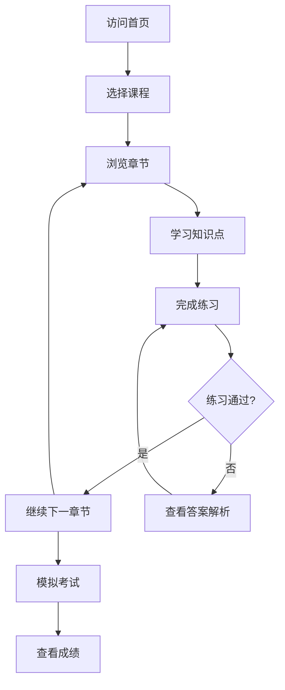

# 职业高考专业知识教学平台 - PRD文档

## 1. Product Overview
职业高考专业知识教学平台是一个面向中国职业高中学生的在线学习网站，涵盖C语言、VFP数据库、网络知识和办公自动化四大核心课程，提供从零基础到高考水平的系统化教学，包含理论讲解和实战题型练习，帮助学生备考职业高考。

## 2. Core Features

### 2.1 User Roles
| Role | Registration Method | Core Permissions |
|------|---------------------|------------------|
| 普通用户 | 无需注册 | 浏览所有课程内容、查看学习资料、完成练习题 |

### 2.2 Feature Module
1. **首页**: 平台介绍、课程导航、学习进度概览
2. **C语言课程**: 入门到精通的完整教学体系
3. **VFP数据库课程**: 数据库基础到高级应用教学
4. **网络知识课程**: 计算机网络基础到专业知识
5. **办公自动化课程**: Excel和Word从入门到精通
6. **题库系统**: 各课程配套练习题和模拟考试

### 2.3 Page Details

| Page Name | Module Name | Feature description |
|-----------|-------------|---------------------|
| 首页 | Hero区域 | 平台介绍、核心课程展示、学习进度统计 |
| 首页 | 课程导航 | 四大课程入口，点击跳转对应课程 |
| C语言课程 | 章节导航 | 按学习阶段划分的章节列表 |
| C语言课程 | 知识点讲解 | 详细的理论讲解和代码示例 |
| C语言课程 | 实战练习 | 配套练习题和编程实践 |
| VFP数据库课程 | 章节导航 | 数据库基础到高级应用章节 |
| VFP数据库课程 | 知识点讲解 | 数据库概念、SQL操作、表单设计等 |
| VFP数据库课程 | 实战练习 | 数据库操作练习题 |
| 网络知识课程 | 章节导航 | OSI模型、TCP/IP、网络安全等章节 |
| 网络知识课程 | 知识点讲解 | 网络原理和协议详解 |
| 网络知识课程 | 实战练习 | 网络配置和故障排查练习 |
| 办公自动化课程 | 章节导航 | Excel和Word分模块学习 |
| 办公自动化课程 | 知识点讲解 | 表格制作、公式应用、文档排版等 |
| 办公自动化课程 | 实战练习 | 办公场景模拟练习 |
| 题库系统 | 章节练习 | 按章节分类的练习题 |
| 题库系统 | 模拟考试 | 综合模拟试卷 |
| 题库系统 | 答案解析 | 详细的答案和解题思路 |

## 3. Core Process
用户访问首页 → 选择感兴趣的课程 → 浏览章节列表 → 学习知识点 → 完成配套练习 → 查看答案解析 → 继续下一章节学习 → 参加模拟考试检验学习成果

## 4. User Interface Design

### 4.1 Design Style
- **主色调**: 深蓝色(#1e3a5f)作为主色，象征专业和信任；搭配橙色(#f97316)作为强调色，突出重要内容
- **按钮风格**: 圆角矩形按钮，悬停时有轻微放大效果
- **字体**: 使用思源黑体作为主字体，代码使用等宽字体
- **布局风格**: 卡片式布局，清晰的信息层级
- **图标**: 使用Lucide图标库，简洁现代风格

### 4.2 Page Design Overview

| Page Name | Module Name | UI Elements |
|-----------|-------------|-------------|
| 首页 | Hero区域 | 大标题、副标题、课程入口卡片、学习进度条 |
| 首页 | 课程导航 | 四个课程卡片，带图标和简介，悬停动画效果 |
| 课程页面 | 侧边导航 | 固定侧边栏，显示章节列表，当前章节高亮 |
| 课程页面 | 内容区域 | 标题、知识点讲解、代码示例、练习题区域 |
| 题库页面 | 题目区域 | 题目描述、选项、答题按钮、答案展示区域 |

### 4.3 Responsiveness
- **桌面端优先**: 完整的侧边栏导航和内容布局
- **平板端适配**: 侧边栏折叠为抽屉式菜单
- **移动端适配**: 顶部导航栏，内容垂直滚动，章节切换使用底部导航

### 4.4 交互设计
- 课程学习进度自动保存（localStorage）
- 练习答案即时反馈
- 代码示例可复制
- 知识点支持展开/折叠
- 平滑滚动和页面切换动画
