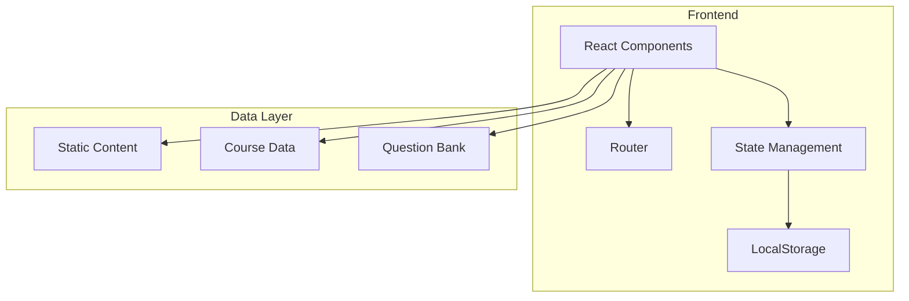

# 职业高考专业知识教学平台 - 技术架构文档

## 1. Architecture Design


## 2. Technology Description
- **Frontend**: React@18 + TypeScript + TailwindCSS@3 + Vite
- **Initialization Tool**: vite-init
- **Backend**: None (纯静态网站，部署在GitHub Pages)
- **Database**: None (使用localStorage存储学习进度)
- **Routing**: React Router DOM
- **State Management**: Zustand (轻量级状态管理)
- **Icons**: Lucide React

## 3. Route Definitions

| Route | Purpose |
|-------|---------|
| / | 首页，展示平台介绍和课程导航 |
| /c-language | C语言课程页面 |
| /vfp | VFP数据库课程页面 |
| /network | 网络知识课程页面 |
| /office | 办公自动化课程页面 |
| /exams | 题库系统页面 |

## 4. Project Structure

```
src/
├── components/           # 通用组件
│   ├── Header.tsx       # 顶部导航栏
│   ├── Sidebar.tsx      # 侧边章节导航
│   ├── CourseCard.tsx   # 课程卡片组件
│   ├── LessonContent.tsx # 知识点内容组件
│   ├── PracticeArea.tsx  # 练习区域组件
│   └── CodeBlock.tsx    # 代码块组件
├── pages/               # 页面组件
│   ├── Home.tsx         # 首页
│   ├── CLanguage.tsx    # C语言课程
│   ├── VFP.tsx          # VFP数据库课程
│   ├── Network.tsx      # 网络知识课程
│   ├── Office.tsx       # 办公自动化课程
│   └── Exams.tsx        # 题库系统
├── data/                # 课程数据
│   ├── cLanguage.ts     # C语言课程内容
│   ├── vfp.ts           # VFP课程内容
│   ├── network.ts       # 网络知识内容
│   ├── office.ts        # 办公自动化内容
│   └── questions.ts     # 题库数据
├── store/               # 状态管理
│   └── appStore.ts      # 应用状态
├── utils/               # 工具函数
│   └── helpers.ts       # 辅助函数
├── App.tsx              # 主应用组件
├── main.tsx             # 入口文件
└── index.css            # 全局样式
```

## 5. Data Structure

### 5.1 课程章节结构
```typescript
interface Lesson {
  id: string;
  title: string;
  description: string;
  content: string;  // HTML格式的知识点内容
  code?: string;    // 代码示例
  exercises?: Exercise[];
}

interface Chapter {
  id: string;
  title: string;
  lessons: Lesson[];
}

interface Course {
  id: string;
  title: string;
  icon: string;
  description: string;
  chapters: Chapter[];
}
```

### 5.2 练习题结构
```typescript
interface Exercise {
  id: string;
  type: 'single' | 'multiple' | 'fill' | 'code' | 'essay';
  question: string;
  options?: string[];
  answer: string;
  explanation: string;
  score: number;
}
```

### 5.3 学习进度结构
```typescript
interface LearningProgress {
  courseId: string;
  chapterId: string;
  lessonId: string;
  completed: boolean;
  exerciseScore: number;
  timestamp: number;
}
```

## 6. 技术实现要点

### 6.1 GitHub Pages部署
- 使用静态路由模式（HashRouter）确保GitHub Pages支持
- 配置vite构建输出到dist目录
- 添加CNAME文件支持自定义域名（可选）

### 6.2 学习进度存储
- 使用localStorage存储用户学习进度
- 课程数据全部内置在前端，无需后端API
- 状态管理使用Zustand保持轻量

### 6.3 代码高亮
- 使用内置的代码块组件，支持语法高亮样式
- 代码示例支持复制功能

### 6.4 响应式设计
- TailwindCSS实现响应式布局
- 移动端使用底部导航栏
- 桌面端使用侧边栏导航

## 7. 构建和部署

### 7.1 构建命令
```bash
pnpm install
pnpm run build
```

### 7.2 部署流程
1. 构建项目生成dist目录
2. 将dist目录内容推送到GitHub Pages分支
3. 配置GitHub仓库的Pages设置

### 7.3 环境变量
无需后端环境变量，所有数据均为静态内置
